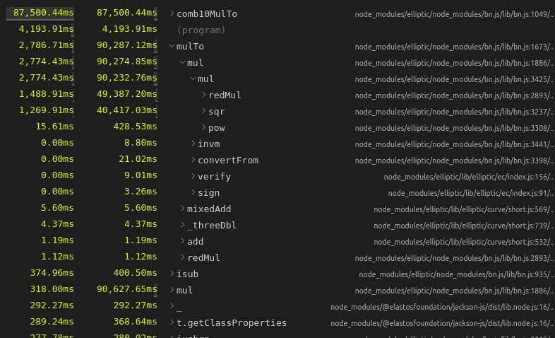
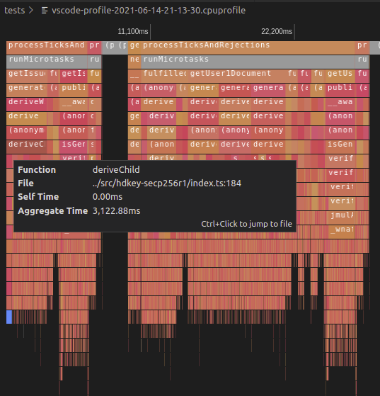
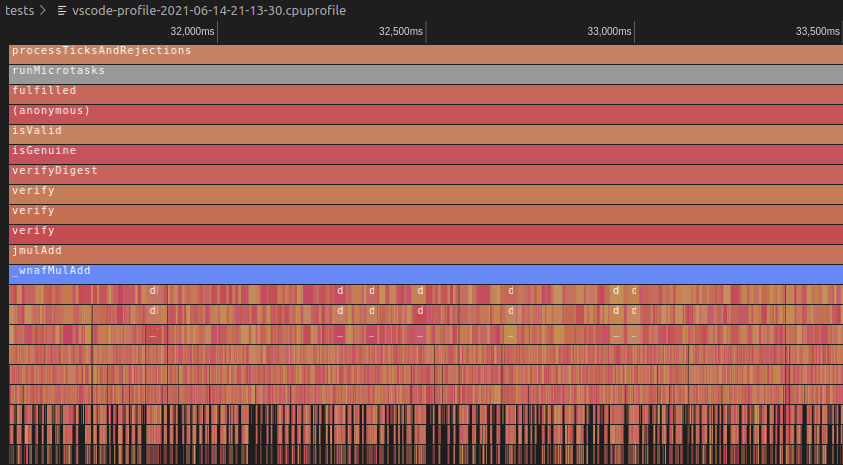

# Elastos DID Typescript SDK

## SDK development workflow

- From the SDK folder: `npm run dev` (this enables hot reload when SDK files change)
- Or `npm run build` without hot reload.

## Writing tests

**Note**: the tests/ folder contains its **own package.json and node_modules**, and depends on the "external library" **@elastosfoundation/did-js-sdk**.

- Open the **tests/** folder as root in a different instance of vscode, this is the only way for now to let vscode display typescript types and issues correctly.
- `npm link ..` (every time after calling `npm install` or `npm update`) from the tests/ folder. This command uses the local version of the DID SDK, that is just in the folder above tests.
- Run one or several tests using one of the options below.

## Running tests

Start the simulated DID chain once:

- From the tests/ folder:
- `npm run simchain`

Several independant options:

- In vscode, Menu -> Run -> **Start debugging**

Or:

- From the command line (SDK or tests/ folders):
- `npm run test:node`

Or:

- Using **jest runner**:
- Click **run** or **debug** directly from the code, above test descriptions.

### Performance issue

We are still optimizing tests migrated from the Java implementation. Running all tests on an up-to-date CPU can take several hours. The main source of this problem has been located in the BigNumber operations of the Elliptic library and the key operations of the hdkey-secp256r1 library. Since there shouldn't be huge impacts on the runtime code, the selected solution has been to develop an automated CI to automatically run tests remotely. Here are some metrics and graphics to show latency sources:

**Profiling metrics showing 'mul' method latency**


[Source profile data](tests/vscode-profile-2021-06-14-21-13-30.cpuprofile)

**Latency from deriveChild hdkey-secp256r1**



Call hierarchy:
 - TestData.getUser1Document
  - TestData.generateKeyPair
   - HDKey.deriveWithPath
    - derive(hdkey-secp256r1)
     - deriveChild(hdkey-secp256r1)


**Latency from jmulAdd of Elliptic**



Call hierarchy:
 - DIDDocument.isValid
  - DIDDocument.isGenuine
   - DIDDocument.verifyDigest 
    - EcdsaSigner.verify
     - verify(Elliptic)
      - jmulAdd(Elliptic)
       - \_wnafMulAdd(Elliptic)


## The DID Adapter

A DIDAdapter is required to publish transactions to the DID chain. Different environments require different adapters such as:

### From the browser

#### Easy way, for mobile or web app developers

Using the Elastos Essentials Connector that provides a DID Adapter over Wallet connect (to let
the wallet app sign transactions):

Pseudo code:

```
let didAdapter = new EssentialsConnector.DIDAdapter();
DIDBackend.initialize(didAdapter);

// In the connectivity SDK
class EssentialsConnector.DIDAdapter {
    createdIdTransaction(payload) {
        let web3provider = new WalletConnectWeb3Provider();
        ler web3 = new Web3(web3provider);
        web3.methods.publishDID(payload);
    }
}
```

#### Tests:

DID SDK tests use a custom adapter with a hardcoded wallet to automate transactions signing
and publishing:

````
class LocalDIDAdapter {
    createdIdTransaction() {
        let acc = {...privatekey-walletwithtestnetfundsinside...};
        acc.sign();
        publishUsingLocalWeb3Instance();
    }
}

let didAdapter = new DIDSDK.Tests.LocalDIDAdapter();
DIDBackend.initialize(didAdapter);
```

#### Custom way:

````
class MyDIDAdapter extends DID.DefaultDIDAdapter {
    createdIdTransaction(payload) {
        // DO custom RPC call
    }
}

let didAdapter = new MyDIDAdapter();
DIDBackend.initialize(didAdapter);
```

## How to publish to npmjs.com

### Publishing account (NPM)

- Be a member of organization: @elastosfoundation

### Useful commands

- `npm adduser` (once)
- `npm login` (once)
- Increase version number in package.json
- `npm publish --access=public`
